# IBM Habit Tracker

This project is a capstone submission for the IBM Flutter course on Coursera. It demonstrates the design and development of a cross-platform habit tracking application using Flutter.

## Project Overview

The IBM Habit Tracker app helps users build and maintain positive habits through an intuitive and engaging interface. The project showcases the following key features and deliverables:

- **User Authentication**: Secure login and registration screens for new and returning users.
- **Home Screen**: Central dashboard displaying user habits and progress.
- **Habit Management**: Add, edit, and delete habits with persistent storage.
- **Notifications**: Local notifications to remind users about their habits.
- **Settings Menu**: Customizable settings for user preferences.
- **API Integration**: Demonstrates integration with external APIs (see evidence folder).
- **Responsive UI**: Works across Android, iOS, web, and desktop platforms.

## Evidence & Documentation

The `evidence/` and `UserStories/` folders contain:
- Screenshots of the app UI and features
- Figma design references
- User stories and requirements
- Evidence of API integration, persistence, and notification features

## Screenshots

Below are some key screens from the IBM Habit Tracker app:

### Home Screen
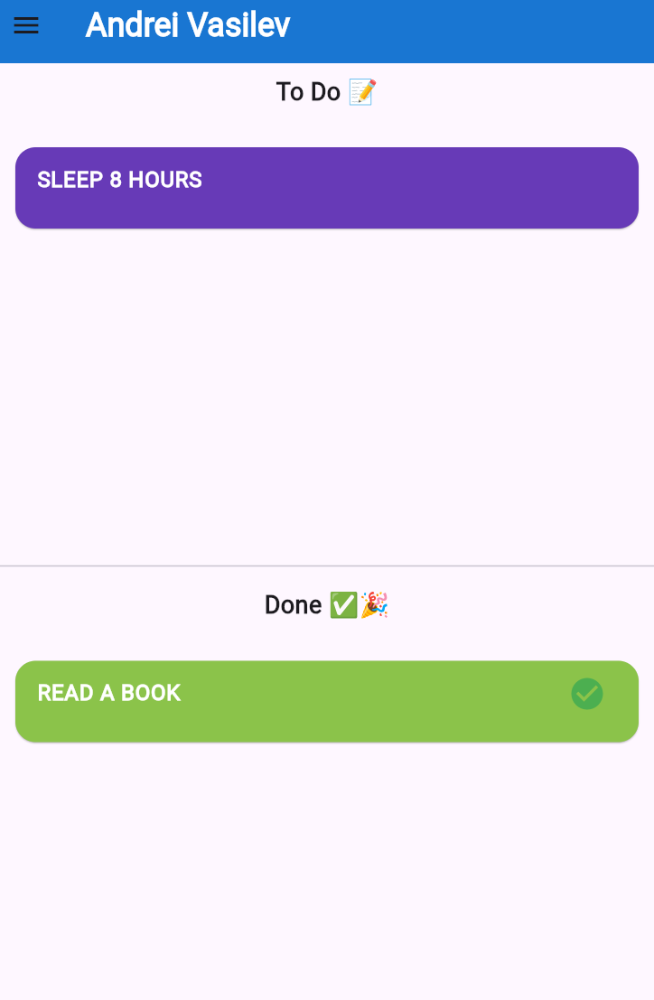

### Login Screen
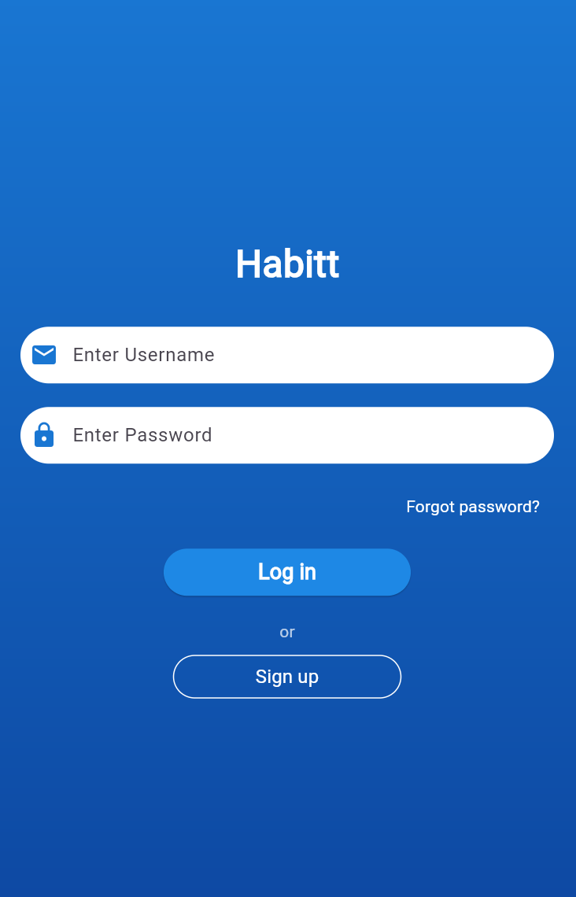

### Signup Screen
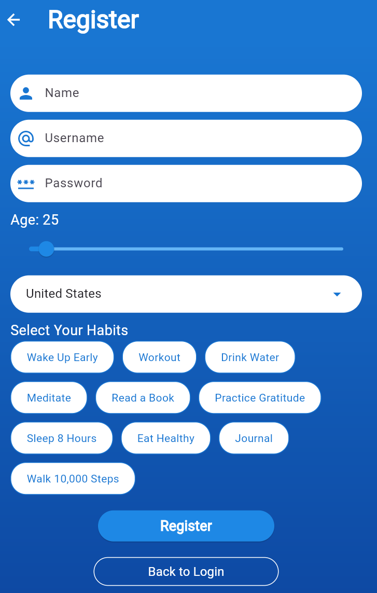

### Habit Detail Screen
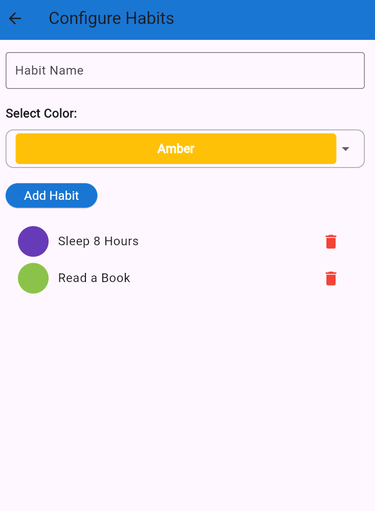

### Menu & Settings
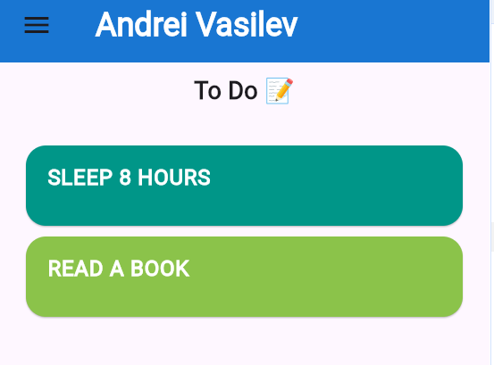
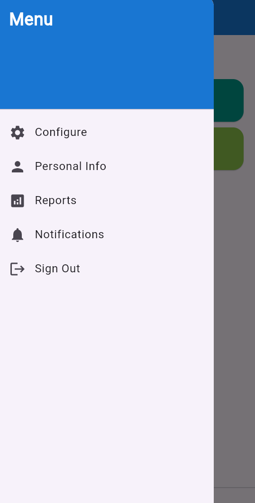
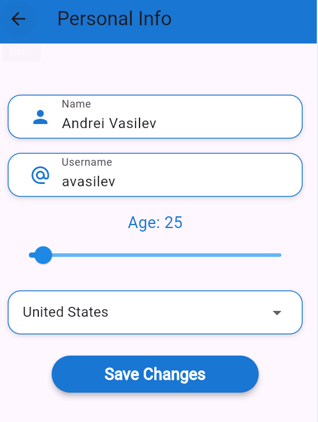

### Notifications
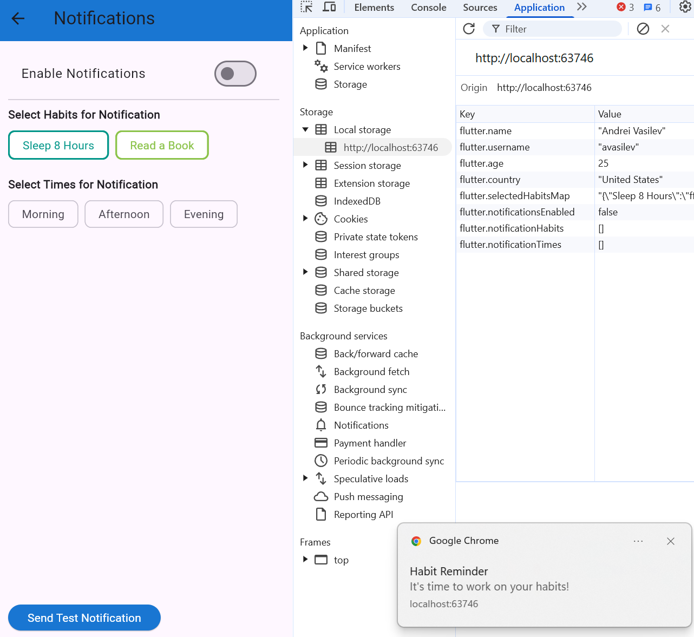
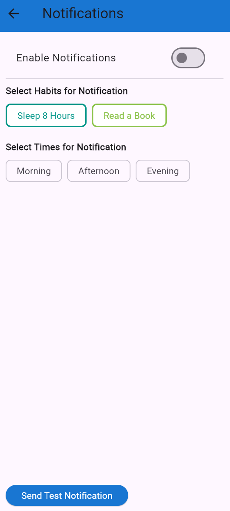

### Persistence & API Integration
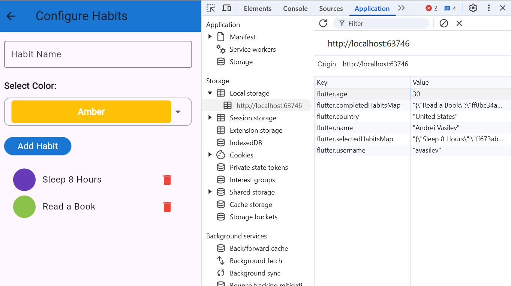
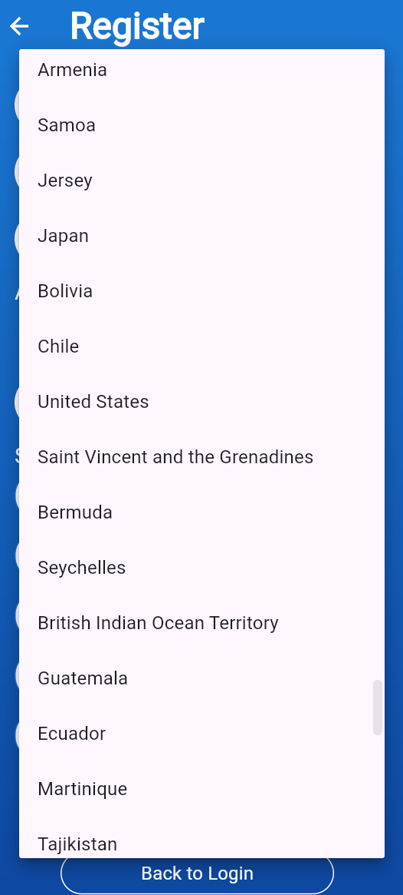

For more evidence and user stories, see the `UserStories/` folder.

## Folder Structure

- `lib/` - Main Flutter app source code
- `evidence/` - Screenshots, Figma designs, and feature evidence
- `UserStories/` - User stories and supporting images
- `project/` - Flutter project configuration and platform-specific files

## How to Run

1. Ensure you have Flutter installed ([Flutter docs](https://flutter.dev/docs/get-started/install))
2. Navigate to the `project/` directory:
   ```bash
   cd project
   flutter pub get
   flutter run
   ```
3. Select your desired platform (Android, iOS, web, etc.)

## Acknowledgements

- IBM and Coursera for the Flutter course and capstone guidance
- Open-source Flutter community for packages and support

---

**This project demonstrates my ability to design, implement, and document a full-featured Flutter application, following best practices in UI/UX, state management, and cross-platform development.**
